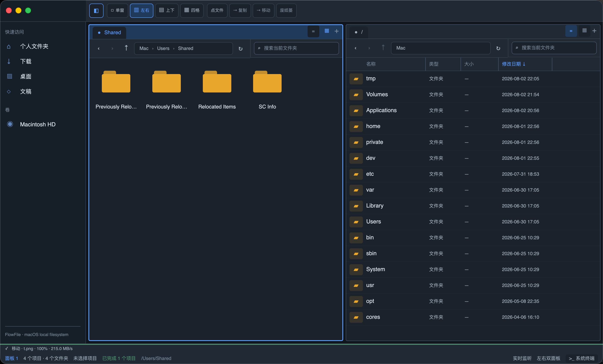

# FlowFile


FlowFile 是一款使用 Rust 和 [GPUI](https://crates.io/crates/gpui) 构建的 macOS 多面板文件管理器。它以类似 Q-Dir 的 1、2 或 4 面板工作区为核心，同时提供真实文件系统访问、异步文件操作、缩略图、Quick Look、Spotlight 搜索和会话恢复。

当前版本：`0.1.0`，最低支持 macOS 11。

## 主要功能

### 多面板工作区

- 支持单面板、左右双面板、上下双面板和四面板布局。
- 每个面板独立维护当前路径、前进/后退历史、排序、隐藏文件开关和视图模式。
- 鼠标点击或 `Tab` / `Shift + Tab` 切换活动面板，活动面板使用强调色边框标识。
- “复制到另一面板”和“移动到另一面板”优先使用最近一次活动的非当前面板作为目标。
- 首次启动默认为单面板大图标网格；后续启动恢复上次会话。

### 文件浏览与导航

- 使用 `tokio::fs` 异步读取真实目录和文件元数据。
- 支持后退、前进、上级目录、刷新、面包屑跳转和可编辑路径栏。
- 路径输入与搜索输入支持 macOS 中文输入法组合文本。
- 文件夹优先排序，支持按名称、大小和修改时间排序。
- 默认隐藏名称以 `.` 开头的项目，可通过工具栏或设置切换。
- 侧边栏提供中文“个人文件夹、下载、桌面、文稿”等快速访问入口。
- 动态读取 `/Volumes`，挂载或弹出卷后通过 `notify` 监听自动更新侧边栏。
- 识别 NTFS 卷并显示当前读写状态；应用内的 NTFS 可写重新挂载功能暂时关闭，相关能力将在后续版本继续开发。
- 当前目录内的文件变化使用 150ms 防抖自动刷新。

### 列表与大图标网格

- 详细列表包含名称、类型、大小和修改日期，所有列左对齐。
- 列标题可点击排序，列宽可拖动调整并具有最小宽度保护。
- 大图标网格根据面板宽度自动计算列数，不固定为四列；`.app` 应用使用应用图标，脚本文件使用终端图标，其他 Unix 可执行文件使用普通二进制文件图标。
- 网格未选中时文件名使用省略号；选中后显示完整文件名。
- 网格选择仅强调图标和标题区域，不绘制大块卡片背景或标题边框。
- 列表和网格都支持在空白处拖动框选；按住 `Cmd` 可叠加选择。
- 使用虚拟列表仅渲染可见行，并只为当前视口中的项目请求缩略图。

### 文件操作

- 系统剪贴板复制、剪切和粘贴；剪切项目以半透明状态显示。
- 新建文件夹、新建空白文本文件、复制副本和原地重命名。
- 移至 macOS 废纸篓，以及通过确认模态框执行永久删除。
- 文件双击通常使用系统默认应用打开，`.app` 应用包会直接启动，带 Unix 执行位的普通文件会直接运行；安装 Notepad-- 后，已知文本文件优先由它打开；普通目录双击进入目录。
- 右键“打开方式”列出 macOS 可用应用，并保留“以文本方式打开”和可自行选择 `.app` 的“自定义打开方式”；文本文件有写权限时可编辑，没有写权限时由文本编辑器只读打开；安装 Notepad-- 后，文本及未知格式会优先列出 Notepad--，普通文本文件也默认由它打开。
- 支持跨面板复制/移动，以及拖到其他面板或侧边栏目录。
- 拖放默认移动，按住 `Option` 时复制。
- 后台文件传输采用异步缓冲读写；同名项目默认生成 `name (1).ext` 一类可用名称。
- 状态栏显示当前文件、进度、百分比和传输速度。

### macOS 风格右键菜单

- 文件菜单：打开、打开方式、Quick Look、剪切、复制、跨面板传输、重命名、废纸篓和显示简介。
- 空白区域菜单：新建文件夹、新建文本文件、粘贴和在系统终端中打开。
- 右键未选中的项目会切换选择；右键已有多选成员会保留多选。
- 菜单通过顶层浮层渲染，不受列表滚动或裁剪区域影响。
- 点击外部、按 `Esc` 或执行菜单命令后自动关闭。

### 缩略图、Quick Look 与文件信息

- 100 MB 内存 LRU 缓存保存已解码图像。
- 磁盘缓存位于 `~/Library/Caches/FlowFile/thumbnails/`，缓存键包含文件路径和修改时间。
- 仅为图片、音频和视频生成缩略图；常见图片优先通过 `rayon` 工作线程和 `image` 解码为 256×256 PNG，其他媒体格式使用 macOS `qlmanage`。
- 按 `Space` 打开或关闭预览，`Esc` 关闭预览。
- 图片预览支持缩放和平移；文本/代码预览最多读取前 100 KB。
- PDF、视频、Office 文档等复杂格式交给 macOS 原生 Quick Look。
- 状态栏文件检查器可显示图片分辨率、文本行数/字数、POSIX 权限和常见 EXIF 信息。

### 搜索、终端与设置

- `Cmd + F` 激活当前面板搜索，输入后经过 150ms 防抖更新结果。
- 支持当前目录和“整台 Mac”两种搜索范围，优先调用 Spotlight `mdfind`。
- Spotlight 不可用时使用 `walkdir` 降级扫描；整机搜索降级时从用户主目录开始。
- 搜索使用文件名模糊匹配并限制为最多 500 个结果，`Esc` 返回原目录。
- `Cmd + Backtick` 或 `Cmd + Shift + T` 在 macOS 系统 Terminal 中打开活动面板目录；FlowFile 不内嵌终端。
- `Cmd + ,` 打开设置模态框，可配置自动/浅色/深色主题、默认布局、隐藏文件以及搜索、终端、Quick Look 快捷键。
- 所有主要按钮均提供延时悬浮提示。

### 会话与窗口生命周期

- 自动保存布局、活动面板、最近活动面板、侧边栏状态，以及每个面板的路径历史、排序和视图模式。
- 不存在或已弹出的历史目录会在恢复时自动清理，并回退到有效目录。
- 点击最后一个窗口的红色关闭按钮会完整退出进程。
- `Cmd + Q` 全局退出；两种退出方式都会触发会话保存。

## 快捷键

| 快捷键 | 功能 |
| --- | --- |
| `Cmd + C` / `Cmd + X` / `Cmd + V` | 复制 / 剪切 / 粘贴 |
| `Cmd + Delete` | 移至废纸篓 |
| `Option + Cmd + Delete` | 永久删除（需要确认） |
| `Cmd + N` | 新建文件夹 |
| `Cmd + Shift + N` | 新建空白文本文件 |
| `Cmd + D` | 复制副本 |
| `Enter` / `F2` | 原地重命名；编辑时提交 |
| `Cmd + R` / `F5` | 刷新当前面板 |
| `Cmd + 1` / `2` / `3` / `4` | 单面板 / 左右双面板 / 上下双面板 / 四面板 |
| `Cmd + Option + 1` / `2` | 详细列表 / 大图标网格 |
| `Tab` / `Shift + Tab` | 下一个 / 上一个面板 |
| `Space` | Quick Look |
| `Cmd + F` | 搜索 |
| `Cmd + I` | 显示简介 |
| `Cmd + Backtick` / `Cmd + Shift + T` | 在系统 Terminal 中打开当前目录 |
| `Cmd + ,` | 设置 |
| `Cmd + Q` | 退出 FlowFile |
| `Esc` | 关闭搜索、预览、右键菜单或模态框 |

搜索、系统终端和 Quick Look 的快捷键可以在设置中重新绑定。

## 运行与开发

### 环境要求

- macOS 11 或更高版本
- 最新稳定版 Rust
- Xcode Command Line Tools 或完整 Xcode

开发运行：

```bash
./scripts/run.sh
```

脚本会根据当前 Mac 架构配置 GPUI 所需的 macOS SDK 参数，构建 Debug 二进制，将其装入固定路径 `target/debug/bundle/osx/FlowFile.app`，签名后启动。GPUI 启用了 `runtime_shaders`，只安装 Command Line Tools 时不需要构建期 `metal` 命令。

检查代码：

```bash
cargo fmt --check
cargo check
cargo test
```

如果 GPUI 的 bindgen 在本机找不到 SDK，可以使用与脚本相同的配置：

```bash
sdk_path=$(xcrun --sdk macosx --show-sdk-path)
export BINDGEN_EXTRA_CLANG_ARGS_aarch64_apple_darwin="--target=arm64-apple-macos11 -isysroot ${sdk_path}"
cargo test
```

Intel Mac 请将变量名和 target 分别改为 `BINDGEN_EXTRA_CLANG_ARGS_x86_64_apple_darwin` 与 `x86_64-apple-macos11`。

## 配置与缓存位置

| 内容 | 路径 |
| --- | --- |
| 偏好设置 | `~/Library/Application Support/FlowFile/preferences.json` |
| 会话状态 | `~/Library/Application Support/FlowFile/session.json` |
| 缩略图缓存 | `~/Library/Caches/FlowFile/thumbnails/` |

## macOS 文件夹权限与签名

默认使用无需证书的 ad-hoc 开发签名。macOS 会根据应用的签名身份记住“桌面、文稿、下载”等受保护目录的授权，因此重新编译后可能再次请求权限。

如需正式分发，可选用 Apple Development 或 Developer ID Application 证书，并显式指定签名身份：

```bash
FLOWFILE_CODESIGN_IDENTITY="Apple Development: Your Name (TEAMID)" \
    ./scripts/build.sh
```

不允许退回 ad-hoc 签名时启用严格模式：

```bash
FLOWFILE_REQUIRE_STABLE_SIGNING=1 ./scripts/build.sh
```

开发时请使用 `scripts/run.sh` 生成的固定 Debug 应用路径，避免 Launch Services 中出现多个相同 Bundle ID 的副本，造成权限对象混淆。

## 构建与发布

生成 Release 应用和 DMG：

```bash
./scripts/build.sh
```

可以通过 `-v`（或 `--version`）为本次构建指定版本号；开头的 `v` 可省略：

```bash
./scripts/build.sh -v v0.1.2
```

指定的版本会写入应用的 `CFBundleShortVersionString`，并用于 DMG 文件名，但不会修改 `Cargo.toml`。

输出：

- `dist/FlowFile.app`
- `dist/FlowFile-<version>.dmg`

如已配置公证凭据，可在构建时提交 DMG：

```bash
FLOWFILE_NOTARY_PROFILE="notary-profile" ./scripts/build.sh
```

`cargo-bundle` 可选；缺失时构建脚本会使用离线方式组装 `.app`。应用 Bundle ID 为 `com.flowfile.app`。

## 工程结构

```text
src/
├── main.rs                    # 应用入口、窗口与退出生命周期
├── actions.rs                 # GPUI Action 与快捷键
├── theme.rs                   # 主题色和尺寸
├── models/
│   ├── file_item.rs           # 文件元数据、格式化与排序
│   ├── multi_pane.rs          # 多面板布局和焦点
│   ├── operations.rs          # 剪贴板、传输状态和文件命令
│   ├── pane.rs                # 面板、历史、选择、搜索与目录监听
│   ├── preferences.rs         # 持久化偏好设置
│   └── session.rs             # 会话保存与恢复
├── services/
│   ├── file_engine.rs         # 异步目录读取、卷和 macOS 打开能力
│   ├── file_operations.rs     # 创建、复制、移动、删除与进度
│   ├── file_watcher.rs        # notify 目录监听
│   ├── thumbnail_engine.rs    # 二级缩略图缓存和后台 Worker
│   ├── quick_look.rs          # 内置及 macOS Quick Look 预览
│   ├── search_engine.rs       # Spotlight 与 walkdir 搜索
│   ├── file_inspector.rs      # 分辨率、文本、权限和 EXIF
│   └── terminal_session.rs    # 打开系统 Terminal
└── views/
    ├── workspace.rs           # 主窗口、工具栏和模态框
    ├── multi_pane_container.rs
    ├── pane.rs
    ├── address_bar.rs
    ├── search_bar.rs
    ├── main_list.rs
    ├── sidebar.rs
    ├── context_menu.rs
    ├── preferences.rs
    ├── status_bar.rs
    └── tooltip.rs
```

## 当前范围

- 仅支持 macOS。
- 布局为 1、2 或 4 面板，不包含三面板布局。
- 终端功能调用系统 Terminal，不提供内嵌 PTY 终端。
- 非图片媒体格式依赖 macOS Quick Look 提供缩略图；复杂格式预览仍交给 Quick Look。

## 开源许可

FlowFile 使用[木兰宽松许可证，第 2 版（MulanPSL-2.0）](LICENSE)发布。
